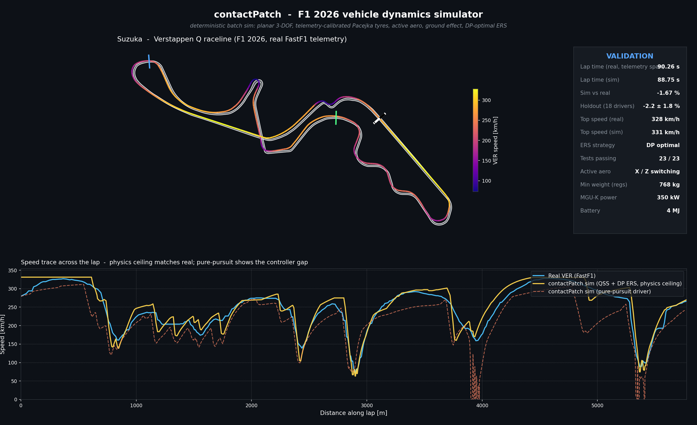
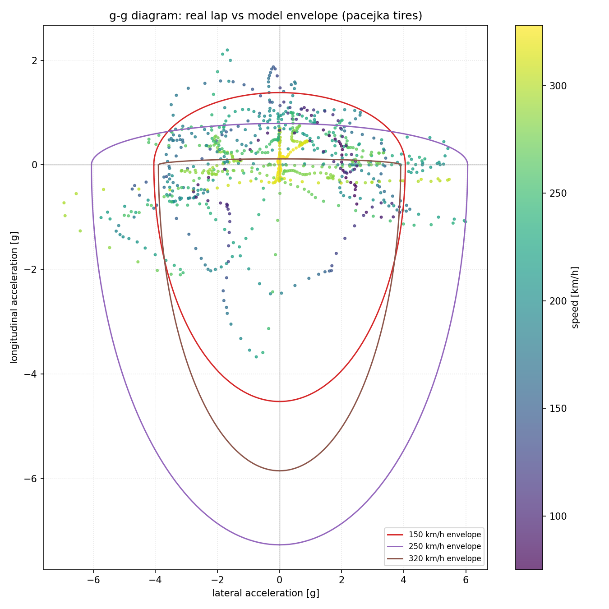

<h1 align="center">contactPatch</h1>

<p align="center">A deterministic vehicle-dynamics simulator for the 2026 Formula&nbsp;1 regulations, in C++20.</p>

<p align="center">
<a href="https://github.com/luismaydana/contactPatch/actions/workflows/ci.yml"></a>
<a href="LICENSE"></a>


</p>



> It also runs as a forecasting instrument: each pole-time call is pre-registered by SHA-256 before qualifying and scored publicly afterwards, hits and misses alike. See [predictions/](predictions/).

contactPatch simulates one Formula 1 car driving a flying lap. The chassis is a planar rigid body with three degrees of freedom (longitudinal, lateral, yaw), coupled to the rotational speed of each of the four wheels. Everything integrates with semi-implicit Euler at a 1 ms substep. Tyre forces come from a Pacejka Magic Formula model with load sensitivity and a temperature model that feeds back into grip. A pure pursuit controller steers the car along the track centerline while a speed planner sets the target velocity from the local curvature and the available downforce. It is deterministic by construction: no randomness, no threads, no iteration-order dependence, so the same inputs give the same lap every run on the same build.

That sentence used to continue "without which none of the hash commitments would mean anything", and that was wrong twice over, so here is the accurate version. The commitments do not come from this C++ core at all; they come from the Python quasi-steady-state path, which is a separate program. And bit-exactness across machines is not achievable here anyway, because `Real` is `float` and the physics calls `sin`, `cos`, `atan2` and `exp`, none of which is correctly rounded by the standard, so MSVC's runtime, glibc and macOS libm each give slightly different last bits.

What actually makes a published hash portable is quantisation. The commitment string carries the lap time to a millisecond, air density to four decimals and the speed cap to a tenth, so a difference has to survive rounding to change the hash. Perturbing the input geometry by a relative ε and watching where the hash breaks puts that threshold near ε = 10⁻⁷, while the cross-platform disagreements that worry people land around 10⁻¹⁵ to 10⁻¹³. Six to eight orders of margin, from rounding rather than from bit-exactness. It is worth stating that way round, because the property being relied on should be the one that is true.

The 2026 rules are what make this version specific. Active aero replaces DRS, so low drag is now a mode the car enters on every straight instead of a flap it earns. The power unit goes close to half electric, which promotes energy management from a detail to the axis a qualifying lap is built around. Minimum mass drops to 768 kg and the tyres get narrower. All of it goes into the physics directly rather than sitting on top as a config layer. A reset like this is also what made the project worth attempting in the first place: in year one of a formula, everyone's historical data ages overnight, and the gap between a from-scratch model and institutional knowledge is the smallest it will ever be.

## What it models

- Planar chassis dynamics, three DOF, coupled to four wheel-speed states.
- A Pacejka-form tyre: the Magic Formula sine with load-sensitive peaks, plus a friction ellipse. Calling it MF 5.2 would be borrowing a named parameter set this does not implement, since the curvature term sits at zero by default, camber is not used, and the cornering stiffness is linear in load rather than saturating. What is modeled is the peak and its fall-off with load, which is the part one lap of telemetry can honestly identify. Braking and turning spend from the same grip budget, so asking the tyre for both at once costs each of them; the ellipse is just that trade written down.
- A tyre thermal model. Temperature moves with slip and load and feeds back into grip in both directions: a cold tyre is numb, an overheated one goes greasy, and the model's Gaussian grip factor is that operating window. A ceiling clamp guards structural integrity.
- 2026 active aerodynamics. The car switches between a low-drag X mode on the straights and a high-downforce Z mode in the corners, chosen from a curvature lookahead. Downforce scales with speed, and the center of pressure sits slightly ahead of the center of mass so aero balance is decoupled from the static weight distribution.
- 2026 power unit split. A 400 kW combustion baseline plus up to 350 kW of electric boost, drawn from a 4 MJ battery that recharges under braking through the MGU-K. A dynamic-programming pass decides where deploying buys the most lap time, so a lap can spend more energy than the battery holds.
- An eight-speed gearbox on an engine torque curve, so drive force falls with speed the way the power cap allows, the engine speed is real, and every corner has a natural gear.
- A limited-slip differential with a viscous term and a Coulomb preload. The differential deserves more explanation than it usually gets, because corner exits are won or thrown away inside it. Through a corner the inside rear unloads; an open diff, which always feeds torque to the wheel that resists least, would happily spin that light wheel and send the engine's work up in smoke, while a welded axle at the other extreme would force both rears to turn together and fight the steering all the way into the apex. The LSD lives between those two failures, and the two terms in the model are its two personalities: the preload is a base locking torque that is simply always there, holding the axle together before any wheel has started to slip, and the viscous term adds locking in proportion to how fast the wheels are separating, so the harder the inside tries to run away the harder it gets tied to the outside. How early that lock builds decides how much throttle the car will accept before the apex, and it wants to be different in a slow hairpin than in a fast fourth-gear sweep, which is why the diff sits on the steering wheel and gets moved between corners rather than set once in the garage.
- Quasi-steady-state lap-time prediction. Corner speeds come from grip and curvature; a backward pass caps every point by what the brakes can recover ahead of it, a forward pass caps it by what the engine can build behind it, and the minimum of the two envelopes is the lap. The ERS optimizer manages the battery on top.
- A FastF1 pipeline that pulls a real session and turns the telemetry into simulator inputs.
- 2D top-down rendering: track surface, racing line, a ghost car animation, and a HUD.

## What this is not trying to be

Worth settling early, because it changes how every number below should be read.

A Formula 1 team simulates its own car with its own CAD, its own wind-tunnel maps and tyre data that never leaves the paddock, on a rig with a driver in it. This is not that. Predicting a lap time more accurately than a works team is not the goal here, and it is not a contest that can be won from public GPS traces.

There is also a floor under everyone and it is measurable. Two team-mates in identical machinery qualify a median 0.37% apart, and that gap is form on the day, traffic, and how the track came to them. No model of a car can see any of it, so 0.37% is the best any car model could ever do. This one sits at 1.414%. The honest ambition is the distance between those two numbers rather than perfection, and it is worth stating plainly that the model may never clearly beat a one-line baseline either, because the 2026 regulations scaled every circuit by nearly the same constant.

### What public data actually costs, measured

The constraint is not that the data is worse in some vague way. It is specific, it is the dominant error source, and it is measurable.

Everything here is built from what FastF1 serves: a position trace at **7.7 Hz**, which at racing speed is a sample every **8 metres**, stretching to 12.6 m on a straight. That is the entire geometric input. A team has its own line at two orders of magnitude more resolution, from a car it owns.

Follow what that does to a corner. A slow hairpin of roughly 25 m radius has about **twenty samples in the whole corner**, and the raw trace carries GPS noise, so curvature cannot be differentiated from it directly and has to be smoothed first. The smoothing this model uses spans **75 metres of arc**. Ninety degrees of that same hairpin is 39 metres. **The filter averages over more arc than the corner occupies**, and the corner speed the solver computes is an average of a curvature the data never resolved.

That is not a coding defect and no amount of careful implementation removes it. It is what reconstructing a racing line from public GPS costs, and it is why changing the smoothing half-width by one moves the predicted lap time by up to 2.57%, which is larger than the model's own σ of 1.414%. The largest open problem in this project is a data problem wearing the costume of a numerical one.

The tyre is the same story from another direction. A team gets a full tyre model under NDA, across the whole load, slip and temperature envelope. Two parameters are fitted here, from one lap of speed trace, because one lap of speed trace can honestly identify about two. And downforce is not identified at all: the fit pins the product of grip and load, so C_L can sit anywhere between 3.5 and 8.0 and reproduce the same lap.

None of that is a complaint. It is the specification. A model built on public data has a floor set by that data, and being precise about where the floor is beats claiming there isn't one.

### The part that is not about data

What is unusual is not the accuracy. It is that the number goes out first and is graded in public. Teams do not publish a pole prediction before qualifying and let it be scored, and not because they cannot: a call that misses by a second is a headline on Monday. Being able to afford to be wrong in the open is the entire structural advantage here, and it is what makes this a record rather than a demonstration.

The clearest evidence is in this repository. A rule one line long scores better than the physics does, and it is published because it is true. A simulator that never runs that comparison never has to find out.

## Limitations

What the model does not do, declared here rather than left for a reader to find on their own. Limitations are choices; the separate list of things that are simply wrong with it, found by audit and published with their measured cost, is [KNOWN-ISSUES.md](KNOWN-ISSUES.md).

- No suspension. Load transfer is quasi-static, worked out from the car's accelerations and the aero pitch term. What a suspension actually does for a lap is control how load arrives: springs and dampers decide whether the weight lands on a tyre smoothly or as a spike, and they are the reason a real car can attack a curb, let the wheel travel absorb it, and keep the contact patch loaded through the strike. This model computes where the load settles and skips how it got there, so pitch, heave, and roll have no dynamics of their own. The practical consequence is that the model lives on smooth asphalt: a lap that gains its time by riding curbs and soaking up bumps is a lap it cannot see. Qualifying softens the blow, since a clean pole lap uses less curb than a race lap fighting for position, but the gap is real and it is one of the named residuals the current σ carries.
- No tyre wear or degradation across a stint.
- One car at a time. No traffic and no wheel-to-wheel racing.
- Dry track only. No weather, no evolving grip, no track temperature.
- The controller drives a geometric line with a grip margin and a set of stability reflexes. Out of the box, with the default global margin, it completes clean laps roughly 20% off the real pace; the offline per-corner margin search (`lap_optimizer`) narrows that. It is not an optimal-control solver, and the line it follows is not the true minimum-time trajectory. Lap-time numbers come from the quasi-steady-state path.

## Validation

The number that matters first, since everything below is either how it was arrived at or what it is not. **Out of fold, across seven circuits, the current model predicts a 2026 pole time with μ +0.102% and σ 1.414%.** Seven circuits, seven folds: fit on six, predict the seventh, repeat, so no error in that average was ever measured on a lap its own fold had trained on. The seven are Miami, Barcelona, Montreal, Spielberg, Silverstone, Spa and Budapest. Miami and Barcelona were genuinely blind calls before they joined the evidence set, and they landed at −0.29% and −0.24% **under the v2.2 configuration those calls were made with**. That scoping matters, because under the current fit the same two circuits sit at −0.66% and +1.09% out of fold, and quoting the old pair next to the current σ would read as evidence for a model that did not produce them. For scale in the other direction, teammates in the same car split by a median 0.37% over 147 qualifying pairs, which is the noise floor no car model can get under. The full derivation is in [predictions/refreeze-2026-v4.md](predictions/refreeze-2026-v4.md), and the two it supersedes are kept beside it. It is regenerable, which it was not until v3: `python scripts/refit_loo.py` rebuilds the fit and both statistics from public telemetry in about half an hour, and all seven fold errors are published. That script was itself an audit finding, since σ used to be the one number a reader could not check in a project whose whole argument is that you should not have to trust the author.

That σ has a rival it does not currently beat. Multiplying a circuit's 2025 pole time by a single constant scores σ 0.99% under the same seven folds, and the comparison is in [predictions/null-model-2026.md](predictions/null-model-2026.md). At n = 7 the two are not separable, which means the physics has not yet earned its complexity. The gap widened rather than closed at the v3 re-freeze, when five corrected defects moved σ from 1.351% to 1.460%, and narrowed slightly at v4, which removed a calibration leak and landed at 1.414%. [refreeze-2026-v3.md](predictions/refreeze-2026-v3.md) explains why a worse number was the more honest one; [refreeze-2026-v4.md](predictions/refreeze-2026-v4.md) explains the harder case, a number that got better after a defect was removed, and what stops that from being tuning. That is the state of the evidence and it is published as such.

The rest of this section is the Suzuka work the model was built on. It is calibration and diagnosis rather than accuracy, and the difference is the whole point of separating them.

Everything here checks against real telemetry from Suzuka 2026 qualifying, pulled through FastF1. Suzuka earns its place as the examiner, and the reason is the first-sector esses. They are a rhythm section: a chain of direction changes where each apex is positioned by the exit of the corner before it, the load swapping sides every couple of seconds, and no straight anywhere to reset on. Carry one extra km/h into the first left and the car arrives at the next right a meter off line, and that meter compounds through every change that follows. This structure is what makes the esses merciless to a tyre model. A single long corner tests peak grip once, and a wrong value can hide inside the driver's margin; the esses test the transfer of load between the axles and across the car, over and over, so an error in load sensitivity shows up as a speed trace that drifts further from the real one with every direction change. A grip model that holds through Suzuka's first sector has nowhere to hide.

The tyre's two peak-friction parameters, base grip and load sensitivity, are fitted to a single lap. Two and not more, on purpose: the full Magic Formula carries dozens of coefficients, and one lap of speed trace can honestly identify about two, so the stiffness, shape and curvature terms hold literature values and only the peaks move. The fit itself is an exhaustive grid search over that two-parameter space, no cleverness, picking the pair that minimizes the speed-trace error of the QSS prediction against Verstappen's lap. Grid search, and not an optimizer, because two parameters is a size where the whole error surface is affordable to compute: 13 × 19 = 247 evaluations, p_dy1 from 1.40 to 2.00 in steps of 0.05 against p_dy2 from −0.20 to −0.02 in steps of 0.01, which is minutes of compute. An optimizer would reach the bottom in a fraction of that and report one pair, with no way to tell a sharp minimum from a long shallow valley of pairs the lap cannot separate. That distinction is the one that matters here: a valley means the two parameters are not individually identified, and quoting either number on its own would be claiming a precision the data does not contain.

One correction to that argument, because the argument as originally written promised something the code does not deliver. `calibrate_tire.py` evaluates all 247 pairs and keeps only the best one; it never stores the surface and never plots it. So the identifiability question the grid was chosen to answer is currently unanswered, and the honest status of the two fitted values is that they are a joint fit whose separability has not been shown. Saving the surface is a ten-line change and it is on the list. The fitted values land where racing slicks live in the literature, a 1.8 lateral peak falling off with load. The fit is then frozen and judged on the eighteen other clean laps of the session, laps it never saw. Frozen first and judged second, because a tyre that keeps learning can explain anything and predict nothing. One tyre for the whole grid.

On the fit lap the predictor comes out at -1.7% of the real 90.27 s with the dynamic-programming ERS optimizer, +1.1% with the greedy one. Across the eighteen other clean laps of that session the optimal-ERS model averages -2.2% with a standard deviation of 1.8, faster than the real lap for sixteen of the eighteen. The sign is the point: a model with a perfect driver and optimal energy use should be faster than real laps, and it is.

What that 1.8 is *not* is the model's accuracy, and the arithmetic that settles it went uncomputed for far too long. Correlate the eighteen predictions against the eighteen real times and **r = −0.010**. The predictions have a realistic spread, 1.159 s against the field's 1.231 s, and none of it points anywhere: allow a free additive offset and R² comes out at −0.905, so guessing that every driver sets the field-mean lap would beat this model. The reason is not mysterious and it is one car model racing twenty different cars, which is a constraint the model declares up front. But the implication has to be drawn rather than gestured at. **Almost all of that 1.8% is car-to-car spread the model cannot see, so these eighteen laps validate a plausible 2026 Suzuka lap time and nothing about cross-circuit accuracy.** A second tell sits in the same output file: the simulated top speed is exactly 92.0 m/s for all twenty-two drivers, the V_CAP clamp, against real values from 85.8 to 93.3. The straight-line part of every lap in that table is a clamp rather than a computation. Aero load and tyre grip also enter as a product, so the split between them stays an assumption until a second circuit separates them.

ERS deployment is a result of its own, with one caveat that has to come first because it is load-bearing. The greedy heuristic, filling the longest acceleration zones first from the fixed 4 MJ store, buys 1.4 s over no ERS. Dynamic programming over position, speed and stored energy buys 4.0 s. The 1.4 is too low: the greedy zone threshold is set where combustion power alone stops saturating the drive-force cap, so it spends charge in a band where extra power cannot reach the road, and part of the gap below is a handicapped baseline rather than a win. The argument for why the DP needs all three state axes survives that correction intact; the size of the margin does not, and it should not be quoted as a clean measurement until the baseline is fixed. Details in [KNOWN-ISSUES.md](KNOWN-ISSUES.md). The state has to be three-dimensional, and the cleanest way to see it is to try deleting each axis and watch what breaks. Drop position, and one megajoule has one price everywhere; but a burst out of a slow hairpin buys visibly more time than the same burst at the end of a straight, so two states the optimizer now considers identical have different values, and an optimizer that assigns one value to two different situations cannot be optimal. Drop speed, and the 2026 taper, which cuts deploy power as speed rises, becomes invisible, so the plan spends full power in exactly the regime where the car cannot receive it. Drop energy, and nothing stops the plan from spending charge it does not have. Each deletion produces a concrete wrong decision, which is the proof that every axis is load-bearing. It buys the extra 2.6 s because it also manages recovery: it deploys 6.1 MJ over the lap, the 4.0 stored plus 2.1 recovered under braking, spending short bursts at corner exits and emptying the battery ahead of heavy braking. Arriving at a big stop with a full battery is regen thrown away; the schedule spends down the store exactly where refilling it is about to be free.

| Quantity | Value | What it measures |
|---|---|---|
| **Pole-time error, 7 circuits, out of fold** | **μ +0.102%, σ 1.414%** | accuracy on a circuit not yet driven |
| Naive baseline, 2025 pole × k, same folds | μ +0.01%, σ 0.99% | what the physics has to beat |
| Teammate spread, 147 quali pairs | 0.37% median | the floor under both |
| Fit lap (Verstappen, Suzuka 2026 Q, real 90.27 s) | 88.75 s (−1.7%) | in-sample, the lap the tyre was fitted to |
| Same session, 18 other clean laps, optimal ERS | −2.2% mean, 1.8 std, r = −0.010 | one car against a mixed grid, not accuracy |
| ERS gain, greedy on the 4 MJ store vs DP with recovery | +1.4 s vs +4.0 s | overstated; the greedy baseline has a known defect |
| Unit tests | 23 / 23 passing | C++ core only, no Python coverage in CI |



## Architecture

```
inputs
  FastF1 session   -- fastf1_loader.py        --> raw telemetry csv
  raw telemetry    -- telemetry_to_inputs.py  --> control inputs csv
  track centerline    (centerline.csv, with sector labels)

core  (C++, contactpatch_core)
  batch_simulator     closed-loop driver, steps the world at 1 ms
    pure_pursuit      steering plus a downforce-aware speed target
    batch_vehicle     3-DOF chassis and 4 wheel speeds, gearbox, ERS, LSD
    aero              active X / Z mode, speed-dependent downforce
    tire_pacejka      slip forces, load sensitivity, temperature
    centerline_track  geometry, curvature, sectors

outputs
  data/sim_results/*.csv     per-lap state trace
    qss_laptime.py           quasi-steady-state lap-time prediction
    ers_dp.py                optimal ERS deployment by dynamic programming
    visualize_ghost.py       2D ghost animation, racing line, plots
```

For the module reference, the simulation loop, and the data formats, see [ARCHITECTURE.md](ARCHITECTURE.md).

## Building and running

The build targets Windows with MSVC and Ninja. From the project root:

```
cmake --preset msvc-release
cmake --build --preset msvc-release
ctest --preset msvc-release
```

There is also an `msvc-debug` preset if you want assertions and debug info.

A GitHub Actions workflow builds and tests on a clean Windows runner and re-checks the published hashes on Linux. Read the badge above rather than this sentence: until the first push lands there are no runs behind it, and a badge with nothing behind it proves nothing.

The build produces `telemetry_runner` and `lap_optimizer`. The optimizer searches the per-corner grip margins against the full simulator and writes a schedule the runner picks up automatically. Run both from the project root so they can find the data folder:

```
.\build\msvc-release\telemetry_runner.exe
```

It loads the Suzuka raceline file and the Verstappen input trace, runs the closed-loop simulation, and writes `data/sim_results/2026_Japan_VER_Q_sim.csv` with the lap time printed to stdout.

The input trace is generated, not stored: telemetry derived from official timing is regenerable through the pipeline but not redistributed with the repository. On a fresh clone, run the first two pipeline commands below once to create it before launching the runner. The optimizer's margin schedule and the DP deploy windows are optional inputs. Without them the runner falls back to a global grip margin and a heuristic ERS gate; running `lap_optimizer` and `scripts/ers_dp.py` recreates them.

The Python scripts handle telemetry and plotting. Install their dependencies with:

```
pip install -r requirements.txt
```

A typical run, from pulling a session to a ghost animation:

```
python scripts/fastf1_loader.py --year 2026 --gp Japan --session Q --driver VER
python scripts/telemetry_to_inputs.py --input data/telemetry/2026_Japan_VER_Q.csv --output data/telemetry/2026_Japan_VER_Q_inputs.csv
python scripts/qss_laptime.py --telemetry data/telemetry/2026_Japan_VER_Q.csv
python scripts/ers_dp.py --telemetry data/telemetry/2026_Japan_VER_Q.csv
python scripts/visualize_ghost.py --track data/tracks/suzuka/centerline.csv --real data/telemetry/2026_Japan_VER_Q.csv --sim data/sim_results/2026_Japan_VER_Q_sim.csv
```

`qss_laptime.py` prints the greedy-ERS prediction; `ers_dp.py` prints the DP-optimal one (the −1.7% headline in the table above) and writes the deploy schedule. To reproduce a registered pole call from the frozen calibration:

```
python scripts/predict_race.py Budapest
```

That script is the archived v1 path, kept byte-frozen, and it is pure local compute: about three seconds, no network, since v1 builds its line from the circuit centerlines shipped in `data/tracks/` and only imports FastF1 when you ask it to score a call or re-run the backtest. Budapest reproduces from it bit-for-bit, hash included. Spa does not, and the reason is written into [predictions/spa-2026/README.md](predictions/spa-2026/README.md): that call predates the single-run lock discipline and its committed string carries about 1 ms of internal drift, so re-running the frozen model today lands 1 ms away and regenerates a different string. Spa is verified through its released preimage instead, which hashes to the registered value exactly. Every call from Budapest onward is locked from a single verified run and reproduces. The scatter the script prints in its caption text is the in-sample figure those two calls were made under, superseded by the summer re-freeze. Calls from Zandvoort onward run under v2.3 through `scripts/predict_v2.py`, and [predictions/refreeze-2026-summer.md](predictions/refreeze-2026-summer.md) documents why the number changed. That one does need network the first time it sees a venue, because the v2.2 line is built from that venue's own 2025 pole lap and the FastF1 cache under `data/fastf1_cache/` is not redistributed here. Once the session is cached the command is offline and deterministic.

Reader-facing setup, from checking a hash with nothing installed to building the whole thing, is in [HOW_TO_USE.md](HOW_TO_USE.md).

## Repository layout

```
contactpatch/
  include/contactpatch/   header interfaces (physics, control, sim, track)
  src/                    implementations
  apps/                   telemetry_runner and lap_optimizer entry points
  tests/                  Catch2 unit tests
  scripts/                python: telemetry loader, QSS predictor, visualizers
  predictions/            pre-registered pole calls: hashes, preimages, VERIFY.md
  data/
    tracks/               centerlines with sector labels (LGPL v3.0, TUMFTM-derived)
    telemetry/            real session inputs (generated locally, not distributed)
    tires/                tyre model provenance (values live in PacejkaConfig)
    vehicle/              2026 baseline provenance (values live in BatchVehicleConfig)
    sim_results/          outputs and plots (generated locally, not distributed)
  docs/                   modeled 2026 rules, references, README figures
  licenses/               LGPL v3.0 + GPL v3.0 texts for the track data
  CMakeLists.txt
  CMakePresets.json
  LICENSE
```

## Dependencies

- A C++20 compiler. The build was developed against MSVC from the Visual Studio Build Tools, and `scripts/build_run.ps1` still carries that path. Worth saying plainly, because it bounds what the C++ claims here are worth: **that toolchain is not currently available on the machine this repository is maintained from.** The prebuilt binary and its 23 passing tests are real and CI builds on a clean `windows-2022` runner, but the seven live defects in [KNOWN-ISSUES](KNOWN-ISSUES.md) section B were found by reading source and doing arithmetic, never by running anything, and they stay unfixed for exactly that reason.
- CMake 3.25 or newer, with Ninja.
- Catch2 v3.5.4 for the tests. CMake fetches it during configure, so there is nothing to install by hand.
- Python 3.11+ for the scripts, with fastf1, pandas, numpy, scipy and matplotlib, pinned exactly in `requirements.txt` because the published hashes depend on them. The ghost animation writes MP4 through imageio-ffmpeg and falls back to GIF without it.

## Predictions

The model also runs as a forecasting instrument. The registry exists because a call that surfaces after the session proves nothing, and a screenshot dates to whenever its author wants it to. A git commit is no better, since its date is whatever its author sets; what carries weight is a push record, kept by somebody who is not me. So for selected 2026 qualifying sessions, contactPatch commits to a pole-time call before the session: the full prediction string is hashed and the hash is published ahead of qualifying. Editing a call after seeing the result would take a second preimage for a published SHA-256, which is exactly as hard for me as for anyone. Once the session is scored, the preimage is released and the result goes up, hit or miss. The registry, the preimages for scored calls, and the verification steps live in [predictions/](predictions/); the check is a `sha256sum` away and requires no trust in the author.

## License

The project's own source code is MIT-licensed, see [LICENSE](LICENSE). One carve-out: the circuit centerlines under `data/tracks/` are derivative works of the [TUMFTM racetrack-database](https://github.com/TUMFTM/racetrack-database) and are distributed under **LGPL v3.0** (full text in [licenses/](licenses/)), not MIT.

contactPatch is an independent open-source project. It is not affiliated with, endorsed by, or associated with Formula 1, the FIA, or any Formula 1 team. Session data is accessed through [FastF1](https://github.com/theOehrly/Fast-F1) and used for calibration and validation; raw timing data is not redistributed with this repository.

Built by Luis Maydana.
